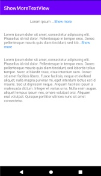
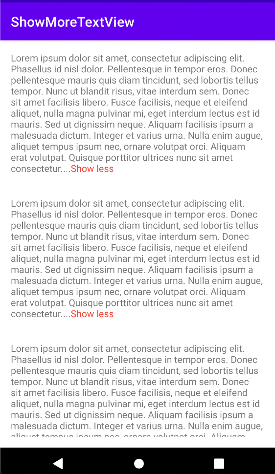

# ShowMoreTextView
A Custom TextView with trim text

## Usage

To use ShowMoreTextView in your layout XML, you can use the following code in your layout:

```xml
<coding.universe.showmoretextview.ShowMoreTextView
        android:layout_width="wrap_content"
        android:layout_height="wrap_content"
        android:text="@string/test_string"
        app:maxLinesVisible="15" />
```

To customize ShowMoreTextView you can use following attributes:

- app:expandedText: Text that appears when the view is expanded.
- app:collapsedText: Text that appears when the view is collapsed.
- app:maxLinesVisible: Maximum Number of lines visible.
- app:showMoreSpanColor: Color that appears when text is collapsed.
- app:showLessSpanColor: Color that appears when text is expanded.

## Screenshots




License
=======

    Copyright 2021 Aayush Chaudhary

    Licensed under the Apache License, Version 2.0 (the "License");
    you may not use this file except in compliance with the License.
    You may obtain a copy of the License at

       http://www.apache.org/licenses/LICENSE-2.0

    Unless required by applicable law or agreed to in writing, software
    distributed under the License is distributed on an "AS IS" BASIS,
    WITHOUT WARRANTIES OR CONDITIONS OF ANY KIND, either express or implied.
    See the License for the specific language governing permissions and
    limitations under the License.